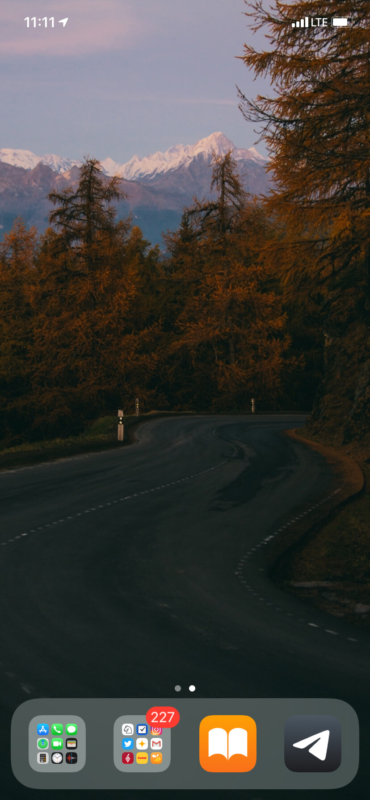

Привет. Как дела?

В ноябре посмотрел всего два фильма, зато каких! Оба идут больше 2 часов и оба потрясающие.

Весь месяц играл в шахматы. Поднял за месяц рейтинг на личесе по рапиду с 1200 до 1400. Вроде стал лучше играть, но все равно довольно часто зеваю фигуры. Решаю задачки из учебника Иващенко, как [посоветовали](https://thequestion.ru/questions/509185/khochu-nauchitsya-khorosho-igrat-v-shakhmaty-no-v-moem-gorode-net-shakhmatnykh-klubov-dlya-vzroslykh-s-chego-nachat-kakie-knigi-chitat-i-kak-sformirovat-nuzhnoe-myshlenie) на The Question. В школу так и не записался, не могу найти группу для взрослых.

Понравилась картина. Не знал, что Магритт играл в шахматы

[Слава](https://www.instagram.com/mzaas/) клево фотографирует природу и ведет [телеграм канал](https://t.me/bgwlppr) с обоями для телефона. Поставил себе эти две.

Вот и кончилась осень.